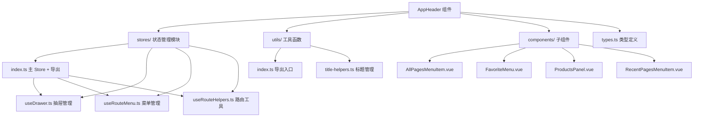

# AppHeader 组件架构说明

## 📁 目录结构

```
components/AppHeader/
├── index.vue                    # 主组件文件
├── types.ts                     # 📋 类型定义
├── stores/                     # 📦 状态管理模块
│   ├── index.ts                # 主 Store + 导出模块
│   ├── useDrawer.ts            # 抽屉菜单状态管理
│   ├── useRouteMenu.ts         # 路由菜单管理
│   └── useRouteHelpers.ts      # 路由工具函数
├── utils/                      # 🛠️ 组件专用工具函数
│   ├── index.ts                # 工具函数主入口
│   └── title-helpers.ts        # 页面标题管理工具
└── components/                 # 🧩 子组件目录
    ├── AllPagesMenuItem.vue    # 所有页面菜单项
    ├── FavoriteMenu.vue        # 收藏菜单组件
    ├── ProductsPanel.vue       # 产品面板组件
    └── RecentPagesMenuItem.vue # 最近访问菜单项
```

## 🎯 各文件职责分工

### 📋 types.ts - 类型定义

- **作用**: 定义组件属性和数据结构，统一管理所有类型定义
- **内容**:

  ```typescript
  // Vue Router 扩展
  declare module 'vue-router' {
    interface RouteMeta {
      title: string
      icon?: string
      // ...
    }
  }

  // 组件属性
  interface Props {
    title?: string
    showDrawer?: boolean
    drawerWidth?: number | string
    // ...
  }

  // 菜单项类型
  interface RouteMenuItem {
    title: string
    path: string
    icon: string
    // ...
  }

  // 配置类型
  interface TitleConfig {
    defaultTitle?: string
    appName?: string
    // ...
  }
  ```

### 📦 stores/ - 状态管理模块

采用模块化设计，按功能拆分为多个 Composables：

#### stores/index.ts - 主 Store + 导出模块 (62行)

- **作用**: 组合各功能模块创建主 Store，同时导出所有模块
- **内容**:

  ```typescript
  // 主 Store - 组合各个功能模块
  export const useAppHeaderStore = defineStore('appHeader', () => {
    const drawer = useDrawer()
    const routeMenu = useRouteMenu()
    const routeHelpers = useRouteHelpers()

    // 组合方法
    const handleNavigation = (path: string) => {
      drawer.closeDrawer()
      routeMenu.recordAccess(path)
      router.push(path)
    }

    return { ...drawer, ...routeMenu, ...routeHelpers, handleNavigation }
  })

  // 导出各个功能模块（可按需使用）
  export { useDrawer, useRouteMenu, useRouteHelpers }
  ```

#### stores/useDrawer.ts - 抽屉菜单管理 (88行)

- **作用**: 管理抽屉开关、悬停状态、配置更新
- **主要功能**: `toggleDrawer()`, `setHoveredItem()`, `updateDrawerConfig()`

#### stores/useRouteMenu.ts - 路由菜单管理 (172行)

- **作用**: 处理路由菜单数据、收藏管理、访问记录
- **主要功能**: `toggleFavorite()`, `recordAccess()`, `getMenuItemByPath()`

#### stores/useRouteHelpers.ts - 路由工具函数 (92行)

- **作用**: 提供路由相关的工具函数和页面标题管理
- **主要功能**: `useRouteTitle()`, `setCurrentPageTitle()`

### 🛠️ utils/ - 组件专用工具函数

专门为 AppHeader 组件提供的工具函数库：

#### utils/title-helpers.ts - 页面标题管理工具

- **作用**: 管理浏览器页面标题的显示和格式化
- **主要功能**:
  - `TitleConfig` 接口 - 标题配置选项
  - `PageTitleManager` 类 - 页面标题管理器
  - `pageTitleManager` 实例 - 默认标题管理器
  - `setPageTitle()` - 设置页面标题快捷函数
- **使用示例**:

  ```typescript
  import { setPageTitle } from './utils'

  // 设置页面标题
  setPageTitle('仪表板')

  // 自定义格式
  setPageTitle('登录', { showAppName: false })
  ```

### 🧩 子组件说明

#### AllPagesMenuItem.vue

- 显示"所有页面"菜单项
- 支持悬停效果和图标动画
- 触发产品面板显示

#### FavoriteMenu.vue

- 管理收藏的页面列表
- 支持拖拽排序功能
- 提供收藏/取消收藏操作

#### ProductsPanel.vue

- 显示所有页面的分类视图
- 支持按分类组织页面
- 提供快速导航和收藏功能

#### RecentPagesMenuItem.vue

- 显示最近访问的页面
- 自动记录访问历史
- 提供快速跳转功能

## 💡 组件特性

### ✅ 功能特点

- 🎨 响应式头部导航栏
- 📱 可折叠的抽屉菜单
- 🌟 页面收藏功能
- 📝 最近访问记录
- 🎯 悬停展开的产品面板
- ⚙️ 高度可配置的外观

### 🎛️ 配置选项

| 属性          | 类型             | 默认值            | 说明             |
| ------------- | ---------------- | ----------------- | ---------------- |
| `title`       | `string`         | `'控制台'`        | 头部标题文本     |
| `titleIcon`   | `string`         | `'mdi-console'`   | 头部标题图标     |
| `showTitle`   | `boolean`        | `true`            | 是否显示标题     |
| `showNavIcon` | `boolean`        | `true`            | 是否显示导航图标 |
| `navIcon`     | `string`         | `'mdi-menu'`      | 导航图标         |
| `showDrawer`  | `boolean`        | `true`            | 是否启用抽屉菜单 |
| `drawerWidth` | `number\|string` | `240`             | 抽屉宽度         |
| `elevation`   | `number\|string` | `2`               | 头部阴影级别     |
| `color`       | `string`         | `'grey-darken-4'` | 头部背景色       |
| `height`      | `number\|string` | `50`              | 头部高度         |

## 🚀 使用方式

### 基础用法

```vue
<template>
  <AppHeader />
</template>
```

### 高级配置

```vue
<template>
  <AppHeader
    title="我的应用"
    title-icon="mdi-application"
    :drawer-width="280"
    color="primary"
    :height="60"
  />
</template>
```

### 自定义内容

```vue
<template>
  <AppHeader :use-custom-content="true">
    <template #custom-content>
      <v-spacer />
      <v-btn color="white" variant="text"> 自定义按钮 </v-btn>
    </template>
  </AppHeader>
</template>
```

### 使用 Store 管理状态

```typescript
import { useAppHeaderStore } from '@/components/AppHeader/stores'

const headerStore = useAppHeaderStore()

// 控制抽屉
headerStore.toggleDrawer()

// 设置悬停项
headerStore.setHoveredItem('all-products')

// 更新配置
headerStore.updateDrawerConfig({ width: 300 })

// 页面标题管理
headerStore.setCurrentPageTitle('自定义标题')
headerStore.setPageTitleByPath('/dashboard')

// 路由菜单操作
headerStore.toggleFavorite('/dashboard')
const recentPages = headerStore.recentItems
```

### 使用工具函数

AppHeader 组件提供了专用的页面标题管理工具：

#### 页面标题管理

```typescript
import { setPageTitle } from '@/components/AppHeader/utils'

// 基础用法
setPageTitle('仪表板')

// 自定义格式
setPageTitle('登录', { showAppName: false })

// 完全自定义
setPageTitle('我的页面', {
  template: '{title} | {appName}',
  separator: ' | ',
  appName: '自定义应用名称',
})
```

### 页面标题管理

AppHeader Store 集成了页面标题管理功能，可以方便地控制浏览器标题栏显示：

```typescript
import { useAppHeaderStore } from '@/components/AppHeader/stores'

const headerStore = useAppHeaderStore()

// 设置当前页面标题
headerStore.setCurrentPageTitle('自定义标题')

// 根据路由路径设置标题
headerStore.setPageTitleByPath('/dashboard')

// 使用临时配置设置标题
headerStore.setCurrentPageTitle('无后缀标题', {
  showAppName: false,
})
```

页面标题会自动根据路由变化更新，默认格式为：`页面标题 - Vue + Vuetify Console`

## 🔧 开发指南

### 添加新的菜单项

1. 在 `components/` 目录创建新的菜单项组件
2. 在 `index.vue` 中引入并注册
3. 在 `types.ts` 中添加相应的类型定义
4. 在 Store 中添加相关状态管理逻辑

### 自定义悬停面板

1. 在 `components/` 目录创建面板组件
2. 在 `index.vue` 的悬停面板区域添加条件渲染
3. 在 Store 中添加面板状态管理

### 扩展开发

#### 添加新的工具函数

1. 在 `utils/` 目录创建新的工具文件
2. 在 `utils/index.ts` 中导出新函数
3. 在 `types.ts` 中添加相应类型定义
4. 更新文档说明

### 样式自定义

组件使用 Vuetify 的主题系统，可以通过以下方式自定义：

```vue
<style scoped>
/* 自定义抽屉样式 */
:deep(.v-navigation-drawer) {
  /* 你的样式 */
}

/* 自定义悬停面板 */
.hover-panel {
  /* 你的样式 */
}
</style>
```

### 组件架构图


